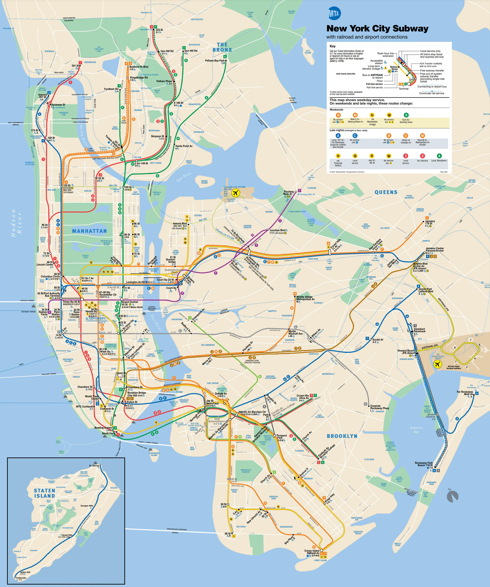
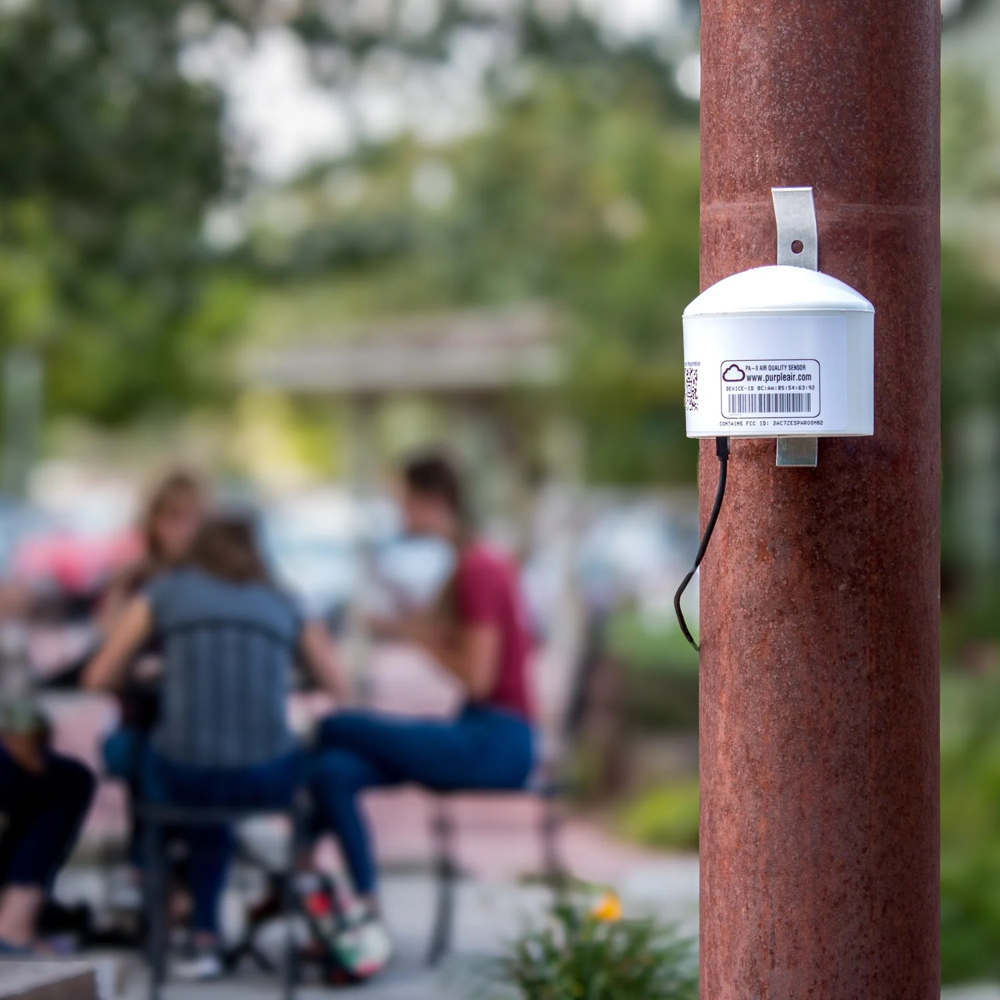

```{=html}
<link href="https://fonts.googleapis.com/css2?family=Lora&family=Roboto&family=Montserrat&display=swap" rel="stylesheet">

<!-- Navigation Bar -->
<nav style="position: fixed; top: 0; width: 100%; background-color: #AC7B84; backdrop-filter: blur(5px); z-index: 1000; padding: 10px 5%; box-shadow: 0 2px 5px rgba(0,0,0,0.1); display: flex; justify-content: space-between; align-items: center; box-sizing: border-box;">
<div style="font-weight: bold; font-size: 1.2em;"></div>
<div style=""font-weight: bold; gap: 100px; flex-wrap: wrap;">
<p style="font-family: 'Lora', serif;">
<a href="#Home" style="text-decoration: none; color: #333; font-size: 1em; margin-left: 30px; ">Home</a>
<a href="#About Me" style="text-decoration: none; color: #333; font-size: 1em; margin-left: 30px; ">About</a>
<a href="#Projects" style="text-decoration: none; color: #333; font-size: 1em;margin-left: 30px; ">Projects</a>
<a href="#Media" style="text-decoration: none; color: #333; font-size: 1em;margin-left: 30px; ">Media</a>
<a href="#Contact" style="text-decoration: none; color: #333; font-size: 1em;margin-left: 30px; ">Contact</a>
</p>
</div>
</nav>

<!-- Section 1: Intro Banner -->
<section id="Home" section style="height: 100vh; display: flex; align-items: center; justify-content: center; padding: 40px; background-color: #F1E9DB;">
<div style="display: flex; align-items: center; gap: 40px; max-width: 1000px; flex-wrap: wrap;">

<div>
<h1 style="font-family: 'Lora', serif;font-size: 2em; margin: 0;">Hi! I'm Mugdha.</h1>
<p style="font-family: 'Lato', serif; font-size: 1em; max-width: 500px;">I’m a global health strategist passionate about designing evidence-based interventions and amplifying research into  advocacy through creative storytelling.Welcome to my website!</p>
</div>
</div>
</section>

<!-- Section 2: About Me -->
<section id="About Me" style="height: 100vh; display: flex; align-items: center; justify-content: center; padding: 40px; background-color: #F2F5EA;">
<div style="max-width: 800px; text-align: left;">
<h2 style="font-family: 'Lora', serif; font-size: 2.5em;">About Me</h2>

<p style="font-family: 'Lato', serif; font-size: 1em;">My global health experience started in India, where I managed operations for a national nutrition assessment, while also supporting development and institutional fundraising. As a partnerships coordinator, I’ve also enjoyed building multilateral relationships to drive impact and improve health outcomes.</p>

<p style="font-family: 'Lato', serif;font-size: 1em; margin-top: 20px;">I am deeply passionate about development communications—an interest that was fostered through journalistic internships during college. After graduation, I spent a year contributing to feminist research across India, focusing on women’s unpaid labor, labor rights, and healthcare access. Most recently, I’ve worked with research and community-based organizations in New York to break down environmental health research into actionable ideas for policy and advocacy. 
</p>

<p style="font-family: 'Lato', serif;font-size: 1em; margin-top: 20px;">I’ve also previously worked as a business analyst and management consultant at a leading global consulting firm. I hold a Master's in Public Policy (MPP) and Public Health (MPH) from Columbia University, specialising in environmental health sciences and infectious disease epidemiology.</p>

<p style="margin-top: 20px; font-family: 'Lora', serif; font-size: 0.8em;">
  <a href="Mugdha_CV.pdf" target="_blank" style="text-decoration: none; color: #0077cc;">
    
    Here's my CV
  </a>
</p>
</div>
</section>

<!-- Section 3: Projects -->

<section id="Projects" style="height: 100vh; display: flex; align-items: center; justify-content: center; padding: 40px; background-color: #F1E9DB;">
<div style="max-width: 800px; text-align: left;">
<h2 style="font-family: 'Lora', serif; font-size: 2.5em;">Projects</h2>

<br>
  <!-- Project 1 -->
<div style="font-family: 'Lora', serif; display: flex; align-items: center; margin-bottom: 30px;">

<div>
<p style="margin: 0; font-size: 1em; font-family: 'Lora', serif;">
Combatting Household Air Pollution in Ghana with Clean Energy (CHAP)<br>
<a href="https://worldprojects.columbia.edu/news-media/chap-research-clean-cooking-fuels-featured-cover-nature-energy-journal" target="_blank" style="color: #0077cc;font-size: 0.8em; text-decoration: none;">Read More about the Project</a> <br>
<a href="https://www.gaspayapp.com/" target="_blank" style="color: #0077cc;font-size: 0.8em; text-decoration: none;">Read More about the Intervention</a>
      </p>
</div>
</div>

 <!-- Project 2 -->
<div style="font-family: 'Lora', serif; display: flex; align-items: center; margin-bottom: 30px;">

<div>
<p style="margin: 0; font-size: 1em; font-family: 'Lora', serif;">
Combatting Household Air Pollution in Ghana with Clean Energy (CHAP)<br>
<a href="GIS_Poster.pdf" target="_blank" style="color: #0077cc;font-size: 0.8em; text-decoration: none;">Check out my poster</a> <br>
      </p>
</div>
</div>

 <!-- Project 3 -->
<div style="font-family: 'Lora', serif; display: flex; align-items: center; margin-bottom: 30px;">

<div>
<p style="margin: 0; font-size: 1em; font-family: 'Lora', serif;">
Combatting Household Air Pollution in Ghana with Clean Energy (CHAP)<br>
<a href="https://lrb4fm-mugdha-kinjawadekar.shinyapps.io/dashboard/" target="_blank" style="color: #0077cc;font-size: 0.8em; text-decoration: none;">Interact with my dashboard</a> <br>
      </p>
</div>
</div>
</section>

<!-- Section 4: Media -->
<section id="Media" style="height: 100vh; display: flex; align-items: center; justify-content: center; padding: 40px; background-color: #F2F5EA;">
<div style="max-width: 800px; text-align: left;">
<h2 style="font-family: 'Lora', serif; font-size: 2.5em;">Media</h2>


